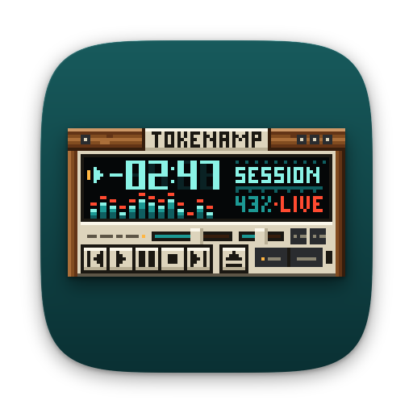
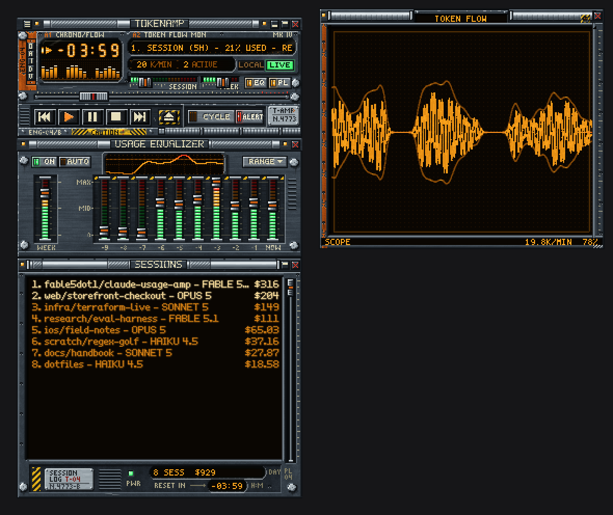
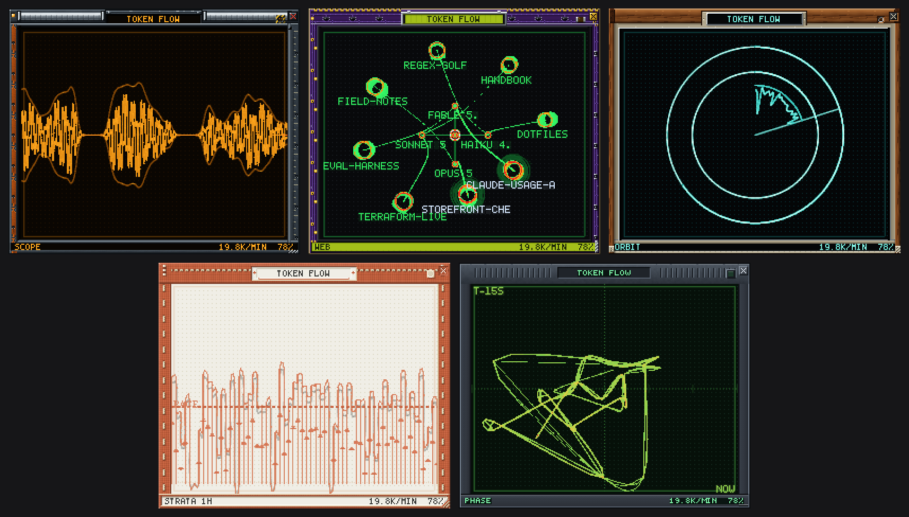
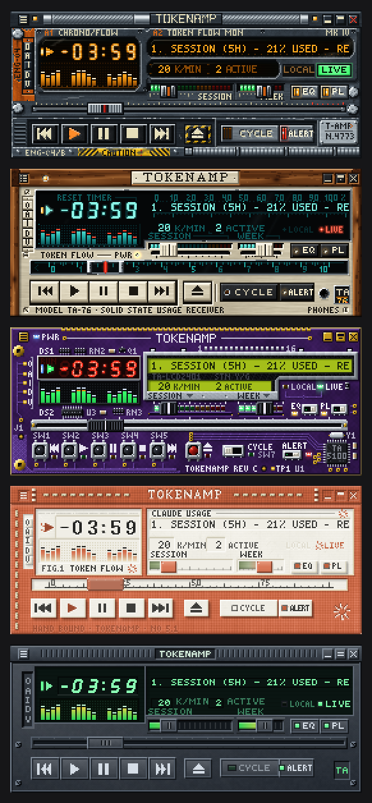

<p align="center">
  
</p>

<h1 align="center">Tokenamp</h1>

<p align="center"><em>Your Claude plan usage, as a Winamp 2.x player.</em></p>

Tokenamp is a native macOS app that reads how much of your Claude plan you have
used — the 5-hour session window, the weekly limits, and the token flow through
your local Claude Code transcripts — and shows it as a skinned player: the time
readout counts down to your next reset, the marquee scrolls the headline
numbers, the visualiser is your token flow, the sliders are your limits, and the
playlist is your sessions.

The visualiser also has a window of its own.

It loads **real classic `.wsz` skins**. The five skins in this repo were painted
pixel by pixel in Python and drop straight into Winamp; skins from 1999 drop
straight into Tokenamp.



## Token Flow

A fourth window, opened from the **V** button on the clutterbar. It is a vector
phosphor display — a beam that accumulates into a buffer and decays, so it is
bright where it lingers and faint where it flies — drawn in skin pixels and
coloured entirely from the skin's own `viscolor.txt`. It has five
configurations:

| | |
|---|---|
| **Scope** | The last six minutes as a bipolar trace: what came out above the axis, what went in below, and the context that was re-read as an echo behind both. One trace per live session. |
| **Strata** | The ledger — fresh tokens per bucket over the last hour, day or ten days, with a pace line at the rate that reaches your next reset without hitting the wall. |
| **Web** | The connectome: your sessions and the models they are running on, pulsing as work arrives, live ones pulled in to the hub and idle ones drifting out. |
| **Orbit** | The limit window as a ring, with the consumed arc filling it and your burn traced inside. Past 85% the ring starts to shed sparks. |
| **Phase** | The flow plotted against itself fifteen seconds earlier. Steady work sits on the diagonal; every burst-and-recover cycle throws a loop off it, so the figure is the rhythm of the work. |

Leave the lamp lit and it picks for itself: the connectome when several sessions
are live, the scope when one is, the ring when you are close to a wall or a
reset. What is on screen is modulated by the state underneath it — the palette
runs hot as a limit fills, a wall closes in past halfway, bursty work leaves a
longer phosphor tail than steady work, and each live session adds a beam.



## The skins

Five, each with its own hand-drawn bitmap typefaces — no system fonts appear
anywhere inside a skinned window.

| | |
|---|---|
| **Bulkhead** | An engineering-deck control module: worn gunmetal plate, chipped safety orange, hazard striping, an amber phosphor CRT behind thick glass. |
| **Walnut 76** | A 1976 stereo receiver: oiled walnut cheeks, brushed champagne aluminium, a backlit teal dial behind black glass, and a red tuning needle for a seek thumb. |
| **Amethyst** | The player with its case off: purple solder mask and ENIG gold, red seven-segment time, an STN character LCD and LED ladders. |
| **Bookcloth** | A hand-bound stationery object, and the only light skin: clay-orange book cloth, ivory laid paper, letterpress labels, linen stitching. |
| **Base** | The restrained reference skin, and the fallback for any sheet a third-party skin leaves out. |



## What it reads, and what it does not

Tokenamp is a read-only monitor. Specifically:

- **Your plan limits** come from one endpoint, `api.anthropic.com/api/oauth/usage`,
  authorised with the OAuth token Claude Code already stores in your login
  keychain under `Claude Code-credentials`. Tokenamp only ever **reads** that
  credential. It never writes to the keychain, never refreshes or exchanges the
  token, and never sends it anywhere else.
- **Your token flow** comes from the JSONL transcripts under `~/.claude/projects`.
  Tokenamp parses only the timestamp, message id, model name, token counts, and
  the session's working-directory path (which is what labels a row in the
  Sessions list). **It never reads, stores or displays the content of your
  messages.**
- Nothing is uploaded, and there is no telemetry. The only outbound request is
  the usage endpoint above.

You can see the whole data layer without the UI:

```sh
swift run usage-dump --once        # one snapshot, printed as a table
swift run usage-dump --json        # the same thing as JSON
swift run usage-dump --no-live     # local transcripts only, no network call
```

## Building

Requires macOS 13 or later and the Xcode Command Line Tools. No Xcode, no
`xcodebuild` — the bundle is assembled by hand and ad-hoc signed.

```sh
scripts/build_app.sh          # -> build/Tokenamp.app
open build/Tokenamp.app
```

To try it without touching your account, run it on synthetic data:

```sh
build/Tokenamp.app/Contents/MacOS/Tokenamp --demo
```

## Using it

Right-click any window (or use the menu-bar item) for the options menu:

- **Windows** — show the Equalizer and Sessions windows; window-shade mode; always on top.
- **Scale** — device pixels per skin pixel, in half steps on Retina. The default is picked from your screen.
- **Skins** — pick a bundled skin, `Load Skin…` to open any `.wsz`, or `Open Skins Folder` to drop your own in.
- **Data** — token or cost readouts, live plan limits on or off, poll interval, refresh now.

The three windows dock to each other and to the screen edges, the way Winamp's
did.

## Repository layout

```
Sources/UsageModel     value types + the UsageProvider protocol (no I/O)
Sources/UsageCore      transcript scanner, plan-limit client, pricing
Sources/TokenampKit    skin engine, windows, renderers
Sources/Tokenamp       the app; the only place UsageCore and TokenampKit meet
Sources/usage-dump     CLI for the data layer

skins/skinkit          the Python painting toolkit
skins/<name>           one folder per skin, with its BRIEF.md
skins/dist/*.wsz       the built archives the app bundles
skins/build.py         the skin build entry point

docs/SPEC.md           the contract for all of the above
skinspec/sprites.json  the sprite map, single source of truth
```

`docs/SPEC.md` is the place to start: it defines the usage-to-Winamp mapping,
the skin engine, the data layer and the `plfont` extension that lets a skin
carry its own proportional list typeface.

## Building the skins

Needs Python 3 with `numpy` and `Pillow`.

```sh
python3 skins/build.py --all           # every skin -> skins/dist/*.wsz
python3 skins/build.py bookcloth       # just one
```

Each build writes the loose sheets, a flat deflated `.wsz`, and mocked-up
preview PNGs, then validates the result — sheet sizes, pressed states that
actually differ, digits that are distinguishable, the visualiser colour
agreeing with `viscolor.txt`, and a genuinely flat archive. A `.wsz` is
reproducible: rebuilding unchanged art produces a byte-identical file.

To write your own skin, add `skins/<name>/theme.py` with a `Theme` subclass —
overriding nothing but the palette already gives you a complete, valid skin.
`skins/README.md` and `skins/skinkit/README.md` have the details, and
`skins/ART_DIRECTION.md` sets the house style.

## Tests

There is no XCTest here (Command Line Tools only), so the suites are built into
the binaries:

```sh
build/Tokenamp.app/Contents/MacOS/Tokenamp --selftest   # 342 checks
swift run usage-dump --selftest                         # 774 checks
cd skins && python3 -m skinkit.selftest                 # 37 checks
```

Skin art is verified by rendering it offscreen, which needs no Screen Recording
permission:

```sh
build/Tokenamp.app/Contents/MacOS/Tokenamp --snapshot /tmp/shots --demo \
    --skin skins/dist/Walnut76.wsz --scale 2
```

## License

MIT — see [LICENSE](LICENSE).

A personal project, not affiliated with or endorsed by Anthropic. The Bookcloth
skin is a fan-made tribute: it evokes a warm, hand-made visual language through
palette, materials and type, and draws its own motifs rather than reproducing
anyone's logo or wordmark. "Winamp" is a trademark of its owner; this project
only implements its classic skin file format.
