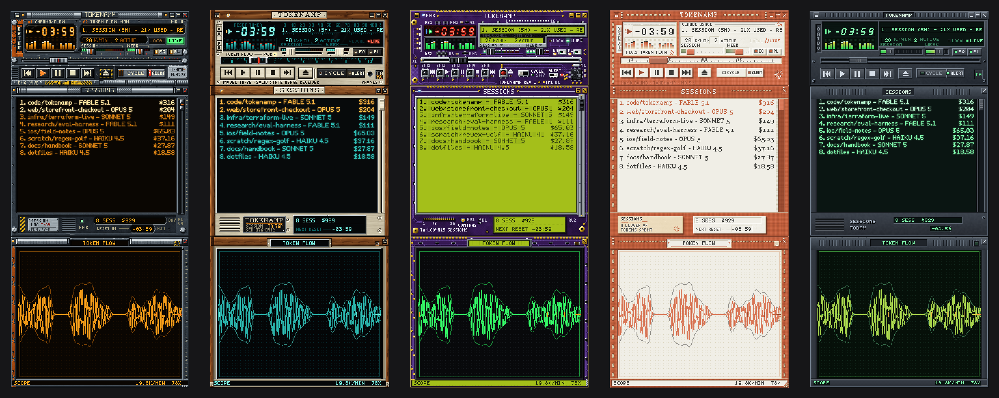

<p align="center">
  
</p>

<h1 align="center">Tokenamp</h1>

<p align="center"><strong>Your Claude plan usage, as a Winamp 2.x player.</strong><br>
A native macOS app with real classic <code>.wsz</code> skins, five of them hand-painted pixel by pixel.</p>

<p align="center">
  macOS 13+ &nbsp;·&nbsp; Swift / AppKit, no Electron &nbsp;·&nbsp; read-only, no telemetry &nbsp;·&nbsp; MIT
</p>

<p align="center">
  
</p>


Tokenamp reads how much of your Claude plan you have used and plays it back as the player you
remember:

- the **time display** counts down to your next limit reset;
- the **marquee** scrolls the headline numbers: session and weekly use, plan, burn rate, today's total;
- the **volume** and **balance** sliders are your session and weekly limits, filling green to red;
- **⏮ ⏭** step through your limits like tracks on a playlist, and the seek bar is how far through
  its window the current one is;
- the **visualiser** is your token flow over the last six minutes;
- the **playlist** is **Sessions**: every project you worked in today, with the model and what it cost;
- the **equalizer** is the last ten hours, days or minutes, one band each.

Hover any gauge and the marquee shows its exact reading. **CYCLE** (shuffle) rotates through your
limits on its own; **ALERT** (repeat) sends a notification at 75, 90 and 100 %, once per limit per
window. Double-click the title bar for window-shade mode, a 14-pixel strip that sits happily on top
of everything.

The windows dock to each other and to the screen edges, and move as one stack, the way Winamp's did.

<br clear="right">

## Token Flow

The third window in the stack is a vector phosphor display. A beam accumulates into a buffer and
decays, so it is bright where it lingers and faint where it flies. It is drawn in whole skin pixels
and coloured entirely from the skin's own `viscolor.txt`. It has five configurations:

| | |
|---|---|
| **Scope** | The last six minutes as a bipolar trace: output above the axis, input below, re-read context as an echo behind both. One trace per live session. |
| **Strata** | The ledger: fresh tokens per bucket over the last hour, day or ten days, with a pace line at the rate that reaches your next reset without hitting the wall. |
| **Web** | The connectome: your sessions and the models they run on, pulsing as work arrives. Live sessions are pulled in to the hub and idle ones drift out. |
| **Orbit** | The limit window as a ring, with the consumed arc filling it and your burn traced inside. Past 85 % the ring starts to shed sparks. |
| **Phase** | The flow plotted against itself fifteen seconds earlier. Steady work sits on the diagonal; bursts throw loops off it, so the figure is the rhythm of the work. |

Leave the lamp lit and it picks for itself: the web when several sessions are live, the scope when
one is, the ring when you are close to a wall or a reset. The state underneath modulates what you
see. The palette runs hot as a limit fills, a wall closes in past halfway, bursty work leaves a
longer tail than steady work, and each live session adds a beam. Scroll on Strata to change its
span.


## The skins

Each skin comes with its own hand-drawn bitmap typefaces. No system font appears anywhere inside a
skinned window.

| | |
|---|---|
| **Bulkhead** | An engineering-deck control module: worn gunmetal plate, chipped safety orange, hazard striping, an amber phosphor CRT behind thick glass. |
| **Walnut 76** | A 1976 stereo receiver: oiled walnut cheeks, brushed champagne aluminium, a backlit teal dial behind black glass, and a red tuning needle for a seek thumb. |
| **Amethyst** | The player with its case off: purple solder mask and ENIG gold, red seven-segment time, an STN character LCD and LED ladders. |
| **Bookcloth** | A hand-bound stationery object, and the only light skin: clay-orange book cloth, ivory laid paper, letterpress labels, linen stitching. |
| **Base** | The restrained reference skin, and the fallback for any sheet a third-party skin leaves out. |

These are real Winamp 2.x skins. They drop straight into Winamp, and classic skins from 1999 drop
straight into Tokenamp. Load one with the eject button, drag a `.wsz` onto any window, or put your
own in `~/Library/Application Support/Tokenamp/Skins/`.

## Install

There is no prebuilt release yet. Tokenamp builds with the Xcode Command Line Tools alone: no
Xcode, no `xcodebuild`. The bundle is assembled by hand and ad-hoc signed.

```sh
git clone https://github.com/lobabobloblaw/tokenamp.git
cd tokenamp
scripts/build_app.sh                     # -> build/Tokenamp.app
cp -R build/Tokenamp.app /Applications/
```

Tokenamp needs a signed-in [Claude Code](https://claude.com/claude-code) on the same Mac. That is
where both the plan limits and the transcripts come from. To try it without touching your account:

```sh
build/Tokenamp.app/Contents/MacOS/Tokenamp --demo
```

## What it reads, and what it does not

Tokenamp is a read-only monitor:

- **Plan limits** come from one endpoint, `api.anthropic.com/api/oauth/usage`, authorised with the
  OAuth token Claude Code already keeps in your login keychain under `Claude Code-credentials`.
  Tokenamp only ever **reads** that credential. It never writes to the keychain, never refreshes or
  exchanges the token, and never sends it anywhere else.
- **Token flow** comes from the JSONL transcripts under `~/.claude/projects`. Tokenamp parses the
  timestamp, message id, model, token counts, and the session's working-directory path, which labels
  its row in Sessions. **It never reads, stores or displays the content of your messages.**
- Nothing is uploaded and there is no telemetry. The only outbound request is the usage endpoint
  above.

Costs are API-equivalent list prices per model, including cache writes, cache reads and fast mode.
They show what the work would have cost on the API, not what your plan charges. The table lives in
`~/Library/Application Support/Tokenamp/pricing.json` if you want to edit it.

The whole data layer runs without the UI:

```sh
swift run usage-dump --once        # one snapshot, printed as a table
swift run usage-dump --json        # the same thing as JSON
swift run usage-dump --no-live     # local transcripts only, no network call
```

## Using it

Right-click any window, or use the menu-bar item, for the options menu:

- **Windows**: Equalizer, Sessions and Token Flow; window-shade mode; always on top.
- **Scale**: device pixels per skin pixel, in half steps on Retina. The default is picked from your
  screen.
- **Skins**: pick a bundled skin, **Load Skin…** to open any `.wsz`, or **Open Skins Folder**.
- **Data**: cost or token readouts, live plan limits on or off, poll interval, refresh now.

The clutterbar letters on the main window are shortcuts: **O** options, **A** always on top,
**I** info (data sources, last fetch, paths), **D** scale, **V** Token Flow.

## Building the skins

The skins are Python programs that paint every pixel. They need Python 3 with `numpy` and `Pillow`.

```sh
python3 skins/build.py --all           # every skin -> skins/dist/*.wsz
python3 skins/build.py bookcloth       # just one
```

Each build writes the loose sheets, a flat deflated `.wsz`, and mocked-up previews, then validates
the result: sheet sizes, pressed states that differ from normal, distinguishable digits, a
visualiser colour that agrees with `viscolor.txt`, and a genuinely flat archive. Builds are
reproducible, so rebuilding unchanged art produces a byte-identical file.

To write your own skin, add `skins/<name>/theme.py` with a `Theme` subclass. Overriding nothing but
the palette already gives you a complete, valid skin. `skins/README.md` and
`skins/skinkit/README.md` (the artist's manual) have the details, and `skins/ART_DIRECTION.md` sets
the house style.

## Development

```
Sources/UsageModel     value types + the UsageProvider protocol (no I/O)
Sources/UsageCore      transcript scanner, plan-limit client, pricing
Sources/TokenampKit    skin engine, windows, renderers
Sources/Tokenamp       the app; the only place UsageCore and TokenampKit meet
Sources/usage-dump     CLI for the data layer

skins/skinkit          the Python painting toolkit
skins/<name>           one folder per skin, with its BRIEF.md
skins/dist/*.wsz       the built archives the app bundles

docs/SPEC.md           the contract for all of the above
skinspec/sprites.json  the sprite map, single source of truth
```

`docs/SPEC.md` is the place to start. It defines the usage-to-Winamp mapping, the skin engine, the
data layer and the Tokenamp extensions to the classic format: `plfont`, which lets a skin carry its
own list typeface, and `gen`, the Token Flow window's frame.

There is no XCTest here (Command Line Tools only), so the suites are built into the binaries:

```sh
build/Tokenamp.app/Contents/MacOS/Tokenamp --selftest   # 630 checks
swift run usage-dump --selftest                         # 950 checks
cd skins && python3 -m skinkit.selftest                 # 37 checks
```

Skin art is checked by rendering it offscreen, which needs no Screen Recording permission:

```sh
build/Tokenamp.app/Contents/MacOS/Tokenamp --snapshot /tmp/shots --demo \
    --skin skins/dist/Walnut76.wsz --scale 3
python3 scripts/make_screenshots.py     # regenerates every image in this README
```

## License

MIT. See [LICENSE](LICENSE).

A personal project, not affiliated with or endorsed by Anthropic. The Bookcloth skin is a fan-made
tribute: it evokes a warm, hand-made visual language through palette, materials and type, and draws
its own motifs rather than reproducing anyone's logo or wordmark. "Winamp" is a trademark of its
owner; this project only implements its classic skin file format.
